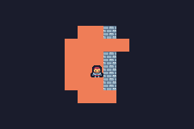
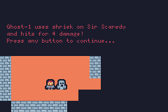
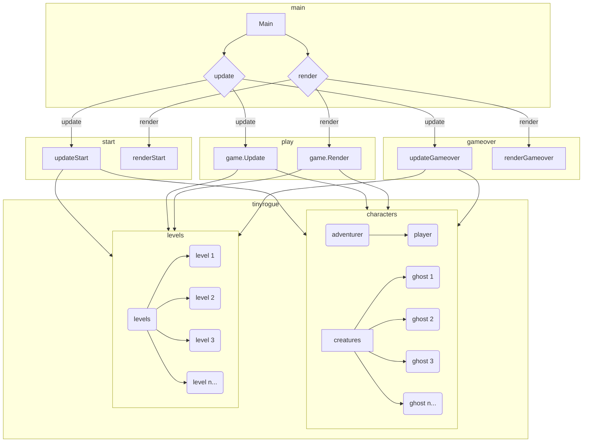

# Ghost Castle



Sir Scaredy has made a wrong turn and ended up in Ghost Castle. There is no escape now! They will have to fight to survive ever increasing numbers of ghosts appearing.



This is a simple [roguelike game](https://en.wikipedia.org/wiki/Roguelike) written using [TinyGo](https://tinygo.org/) with the [TinyRogue framework](https://github.com/deadprogram/tinyrogue) for [Firefly Zero](https://fireflyzero.com/).

This repo shows how to make a complete game.

## Building

To build:

```shell
firefly_cli build
```

To run:

```
firefly-emulator
```

## Code architecture

### How the game functions

The main program has 3 primary functions.

The `boot()` function is where the TinyRogue setup for the game happens, by calling the `setupGame()` function.

The `update()` function is used to manage the state of the game. It controls the game rules and behavior. This function will be called many times per second. This is where the program checks to see if the player has pressed any buttons, and controls the logic about if the player has been attacked by a ghost, the score of the game, etc. Most of this logic is handled by calling the `game.Update()` function so it can be handed by the TinyRogue game engine.

The `render()` function is called to display the game graphics. It controls how things look on the screen, such as drawing the graphics for the  player, the map, and any ghosts that made have appeared. The function is called only when the screen needs to be refreshed, which is less often than the `update()` function that controls the game play. Most of this logic is handled by calling the `game.Render()` function so it can be handed by the TinyRogue game engine, in a similar way to how the `update()` function is handled.

### Game modes

The game has three different modes:

- `start` - before a new game has started
- `play` - while the game is being played
- `gameover` - after the game has ended

As such, there is an `updateStart()` function and a `renderStart()` function for the `start` mode.

Likewise, there is a  an `updateGameover()` function and a `renderGameover()` function for the `gameover` mode.

The `play` mode is of special note, since what it mostly does is call the `game.Update()` functions of the `Game` that is the main entry point for the TinyRogue engine.

### Game characters

The game has 2 different characters that are involved with the game play. One is the `Adventurer` that the player is controlling. The `Adventurer` type embeds the `tinyrogue.Player` type so it can use the predefined functionality for display and movement.

The other is the `Ghost` type that represents the creatures that the player has to battle. The `Ghost` type embeds the `tinyrogue.Creature` type so it can also use the predefined functionality.

### Game action

The game action is what controls what happens when the `Adventurer` and `Ghost` get into contact. This game uses a `CombatAction` with a pretty minimal set of rules for attack and defense.

There is a `Combatant` interface defined, that has a type already defined so that the `Adventurer` and `Ghost` can embed it and pick up the standard functionality defined for the `CombatAction`.

## Architecture diagram

This diagram shows the relationship between the different game functions, game modes, and the game characters.



## Credits

Uses graphics from https://kenney.nl/assets/tiny-dungeon

